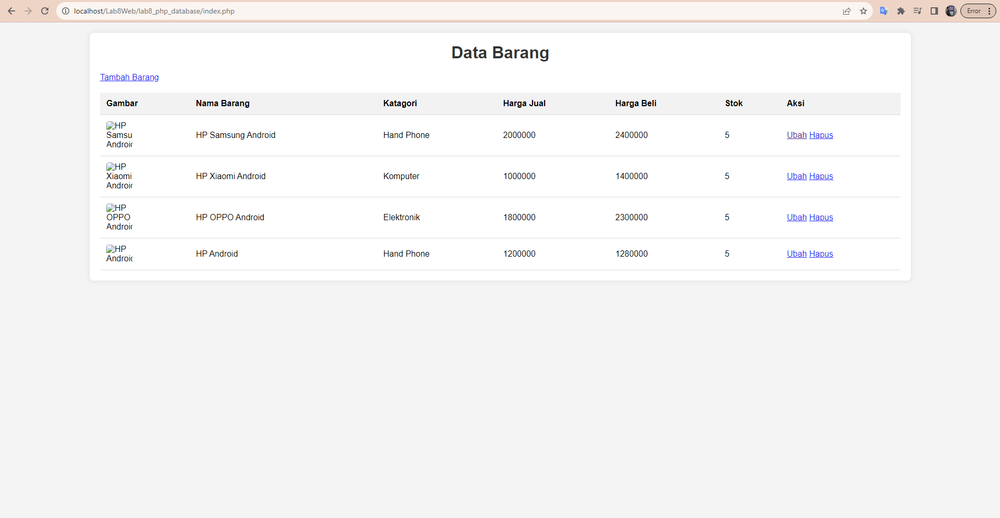
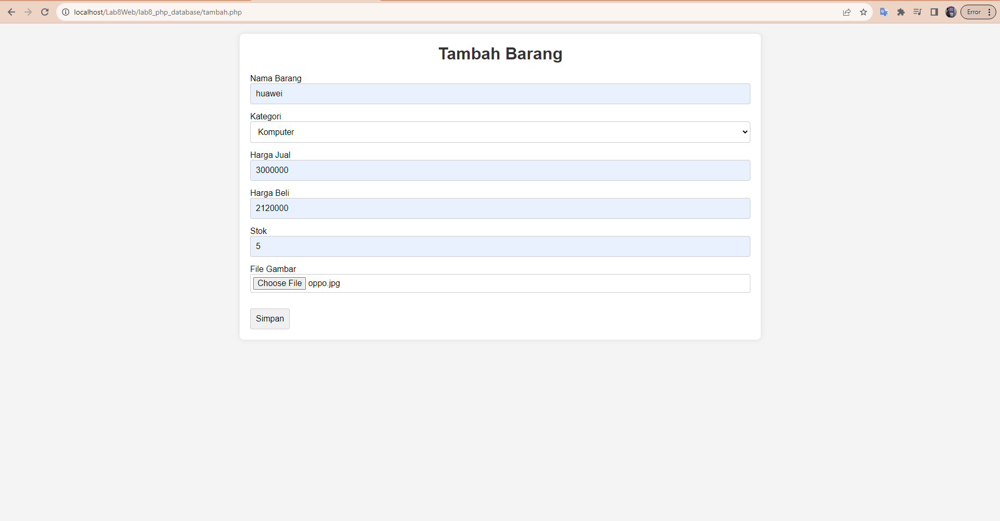
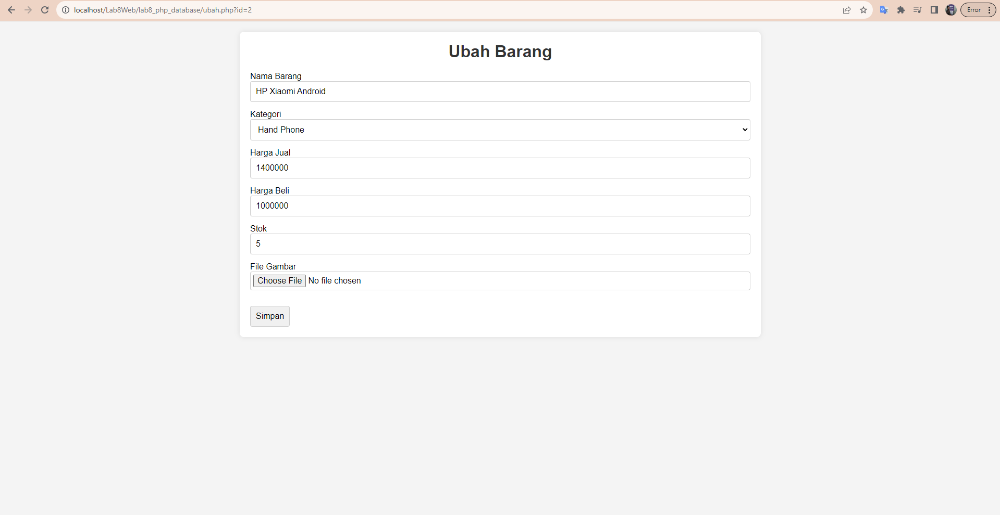
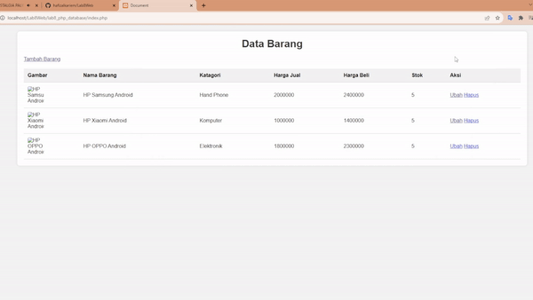

# Lab8Web

# Koneksi PHP ke Database

Repositori ini menyediakan template dasar dan contoh penggunaan PHP dengan database, bersama dengan operasi dasar pada database. Baik Anda seorang pemula atau mencari referensi cepat, panduan ini akan membantu Anda memulai.

## Daftar Isi

- [Lab8Web](#lab8web)
- [Koneksi PHP ke Database](#koneksi-php-ke-database)
  - [Daftar Isi](#daftar-isi)
  - [Pendahuluan](#pendahuluan)
  - [Memulai](#memulai)
  - [Menjalankan Query](#menjalankan-query)
  - [Contoh](#contoh)
  - [Kontribusi](#kontribusi)
- [Tugas Praktikum](#tugas-praktikum)
  - [Source-code](#source-code)
  - [Screenshoot](#screenshoot)
    - [index.php](#indexphp)
    - [tambah.php](#tambahphp)
    - [ubah.php](#ubahphp)
    - [hapus.php](#hapusphp)
- [Terimakasih](#terimakasih)

## Pendahuluan

PHP adalah bahasa pemrograman sisi server yang populer, dan mengintegrasikannya dengan database adalah tugas umum dalam pengembangan web. Repositori ini memberikan pendekatan yang sederhana dan jelas untuk menghubungkan PHP dengan database menggunakan ekstensi PDO (PHP Data Objects).

## Memulai

**Clone Repositori:**

```bash
git clone https://github.com/nama-pengguna-anda/php-database.git
cd php-database
```

Konfigurasi Koneksi Database:

Buka file config.php dan perbarui parameter koneksi database:

```php

<?php
// config.php

define('DB_HOST', 'host_anda');
define('DB_USER', 'nama_pengguna_anda');
define('DB_PASSWORD', 'kata_sandi_anda');
define('DB_NAME', 'nama_database_anda');

```

Jalankan Contoh:

Telusuri direktori contoh untuk menemukan skrip contoh operasi database umum. Modifikasi sesuai kebutuhan Anda dan jalankan dalam lingkungan PHP Anda.

## Menjalankan Query

Kelas Database juga mencakup metode untuk menjalankan query (executeQuery) dan mengambil hasil (fetchResults). Lihat file db.php untuk lebih banyak detail.

```php
<?php
// Sertakan kelas koneksi database
require_once 'db.php';

// Buat instance Database baru
$database = new Database();

// Gunakan $database->getConnection() untuk mendapatkan objek koneksi PDO
$conn = $database->getConnection();
```

## Contoh

Jelajahi direktori contoh untuk kasus penggunaan praktis, seperti:

Memasukkan data ke dalam database
Mengambil catatan dari database
Memperbarui catatan yang sudah ada
Menghapus catatan dari database
Silakan ubah dan integrasikan contoh-contoh ini ke dalam proyek Anda.

## Kontribusi

Kontribusi dipersilakan! Jika Anda memiliki perbaikan, perbaikan bug, atau contoh tambahan, jangan ragu untuk membuka isu atau mengirim pull request.

# Tugas Praktikum

Laporan Praktikum

1. Buatlah repository baru dengan nama Lab8Web.
2. Kerjakan semua latihan yang diberikan sesuai urutannya.
3. Screenshot setiap perubahannya.
4. Buatlah file README.md dan tuliskan penjelasan dari setiap langkah praktikum
   beserta screenshotnya.
5. Commit hasilnya pada repository masing-masing.
6. Kirim URL repository pada e-learning ecampus

## Source-code

- [Index.php](lab8_php_database/index.php)
- [tambah.php](lab8_php_database\tambah.php)
- [ubah.php](lab8_php_database/ubah.php)
- [hapus.php](lab8_php_database/hapus.php)

## Screenshoot

### index.php



### tambah.php



### ubah.php



### hapus.php



# Terimakasih
